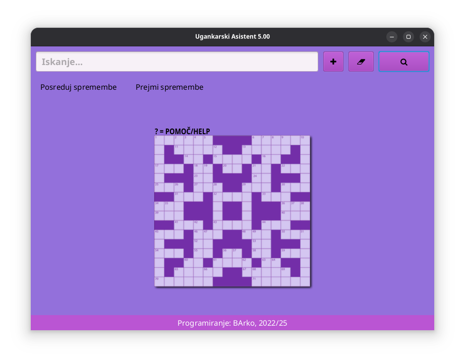
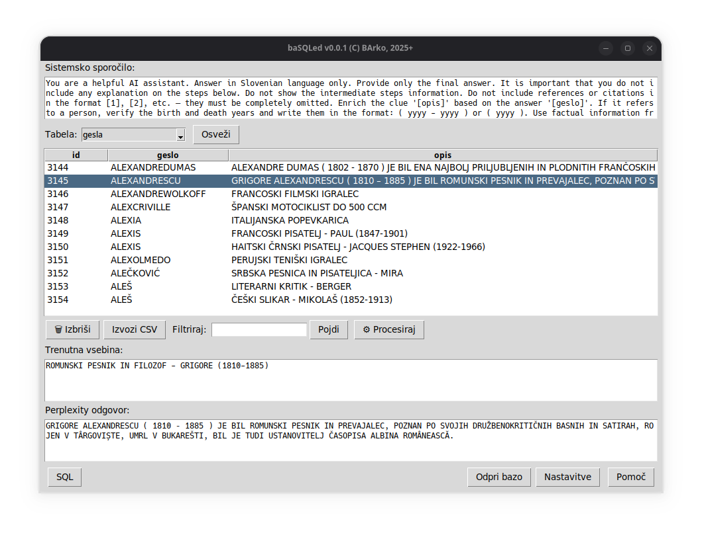

# Ugankarski Asistent v5



**Ugankarski Asistent v5** je brezplačen namizni in mobilni pripomoček za pomoč pri reševanju križank, ugank in sorodnih miselnih nalog.

Aplikacija vključuje bogato zbirko gesel in opisov, zbranih iz različnih virov ter prispevkov uporabnikov. Namenjena je slovenskim in angleškim uporabnikom in deluje tudi brez internetne povezave.

👉 [Več informacij na uradni spletni strani](https://ua.generacija.si)

---

## 🔍 Funkcionalnosti

- Slovenski in angleški besednjak z opisi
- Hitro iskanje gesel in predlogov
- Offline delovanje (internet potreben le za posodobitve baze in prenos nove verzije)
- Brez potrebe po namestitvi (za namizno različico)
- Podpora za Android naprave

## 💻 Namizna različica

### Zahteve za namizno različico

- [Java Runtime Environment (JRE)](https://www.java.com/en/download/) (priporočena zadnja verzija)
- Operacijski sistem: Windows, Linux, macOS

### Namestitev

1. Prenesi najnovejšo različico z [https://ua.generacija.si/#prenos](https://ua.generacija.si/#prenos)
2. Zaženi aplikacijo z dvojnim klikom na zagonsko datoteko (`.jar`)

## 📱 Android različica

- Prenesi aplikacijo neposredno iz spletne trgovina play
- Aplikacijo zaženi kot vsako drugo Android aplikacijo

## 🌐 Jeziki

- **Slovenščina** – osnovni jezik aplikacije
- **Angleščina** – samodejno aktivirana, če sistem ni v slovenščini

## 🤝 Prispevaj

Prispevaj gesla ali izboljšave! Če imaš predloge, izboljšave ali gesla, jih lahko deliš prek uradne spletne strani ali GitHub izdaj.

## 💚 Podpri projekt

Projekt je brezplačen, a lahko prispevaš k njegovemu razvoju s prostovoljnim prispevkom:

[Doniraj preko PayPal](https://www.paypal.com/donate/?hosted_button_id=4BS9ZUXJ2P7GN)

## 📄 Licenca

Ta projekt je na voljo pod odprtokodno licenco ([MIT](LICENSE)), razen aplikacija "Ugankarski Asistent", ki (še) ni odprtokodna.

# baSQLed – SQLite pomočnik z AI podporo 🇸🇮



**[baSQLed](basqled.py)** je namizna aplikacija, napisana v Pythonu z uporabo `tkinter`, ki omogoča enostavno pregledovanje, urejanje in procesiranje SQLite baz podatkov za Ugankarski Asistent. Vgrajena podpora za **Perplexity AI API** omogoča avtomatsko izboljšavo besedil v bazi. Izdelano z uporabo naprednega prompt inženiringa za ChatGPT.

## 🎯 Glavne funkcije

- ✅ Odprtje in prikaz SQLite baz podatkov
- ✍️ Dvoklik za urejanje posameznih celic (npr. polja *opis*)
- 🤖 Integracija z Perplexity AI (prek API-ja) za predlog popravkov vsebine
- 🧠 Uporaba sistemskega *prompt-a* z oznakama `[geslo]` in `[opis]`
- 📄 Izvoz podatkov v CSV
- 🔍 Filtriranje podatkov po ključnih besedah
- 💾 SQL urejevalnik z vrsticami
- 🗃️ Shranjevanje sprememb v `spremembe.txt` (pošljite datoteko spremembe.txt na ua at generacija.si za vnos vaših sprememb v odprtokodno UA bazo)

---

## 📦 Odvisnosti

- Python 3.7+
- `tkinter` (standardno vključen v večino Python namestitev)
- `requests`

Namesti manjkajoče knjižnice z:
```bash
pip install requests
