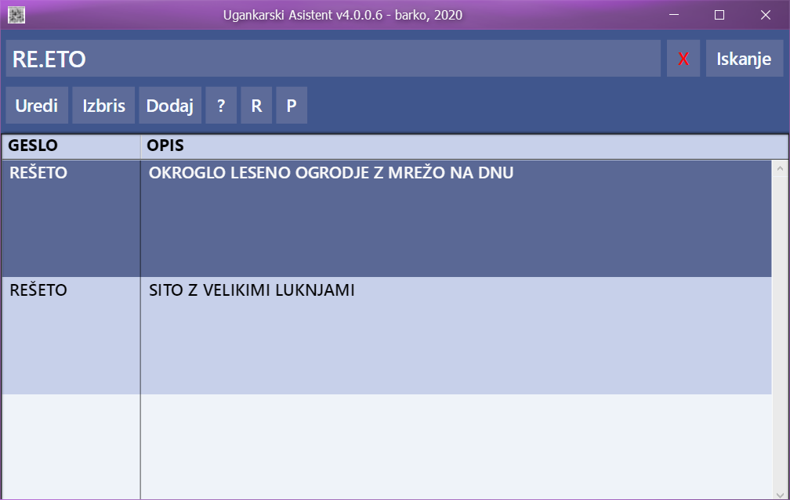

# Ugankarski Asistent - izdelano v <a href="https://github.com/OpenXTalk-org">OpenXTalk</a>

<a href="LICENSE">LICENCA</a>

Izvorno kodo (datoteka <a href="ua4-os.otxstack">ua4-os.otxstack</a>) odprete z OpenXTalk, kliknete na "Browse tool", aplikacija je pripravljena za delo. V kolikor dodate tudi <a href="database.db">database.db</a> datoteko ob izvorni kodi, boste lahko tudi iskali po bazi vseh gesel in opisov. Če želite začeti z lastno kreacijo baze, potem preimenujte database-prazna.db v database.db, brez tega program ne bo deloval pravilno.

Kako deluje:

* Aplikacija omogoča iskanje, dodajanje novih, urejanje obstoječih in brisanje gesel in opisov.
* Iskanje poteka tako, da vpišemo v iskalno vrstico zaporedje znakov za gesla (primer: "REŠETO"), lahko uporabimo znak za piko "." za vse neznane črke v geslu, v kolikor želimo zožiti zadetke pa lahko dodamo ob geslu tudi delni opis gesla, ločen s presledkom (primer: "REŠETO SITO").
* Iskanje lahko izvedemo tudi samo po opisu, zato vpišemo v iskalno vrstico delni opis, uporabimo tudi presledek (primer: " SITO"), ki ločuje geslo od opisa.
* Kako deluje zbiranje gesel in opisov uporabnikov? Aplikacija omogoča pošiljanje sprememb uporabnikov, ki pošiljajo svoja urejanja gesel in opisov preko prilubljenega epoštnega klijenta. Te podatke se shrani v datoteko za tekočo verzijo (primer: 4.1.0.0), ki jo program pri posodobitvah na zahtevo prebere in vstavi spremembe v vašo bazo.

Izvršne datoteke:

OpenXTalk omogoča prevajanje izvorne kode (z določenimi nastavitvami), za uporabnike, ki niso vešči prevajanja izvršne kode so že pripravljene izvršne datoteke v naslednjih arhivih:

Windows verzja: <a href="https://github.com/trinajstica/ua/raw/master/bin/ua64-windows.zip">prenos</a> 64 bit ali <a href="https://github.com/trinajstica/ua/raw/master/bin/ua32-windows.zip">prenos</a> 32 bit

Linux verzija: <a href="https://github.com/trinajstica/ua/raw/master/bin/ua64-linux.zip">prenos</a> 64 bit

Mac OS X verzija: <a href="https://github.com/trinajstica/ua/raw/master/bin/ua64-macosx.zip">prenos</a> 64 bit

Android od verzije 5 naprej: <a href="https://play.google.com/store/apps/details?id=com.preprosto.ua3">Google Play trgovina</a> (armv7, arm64, x86 in x86_64)

Več informacij o jeziku OpenXTalk lahko dobite na uradnem <a href="https://forums.openxtalk.org/">forumu</a>.
