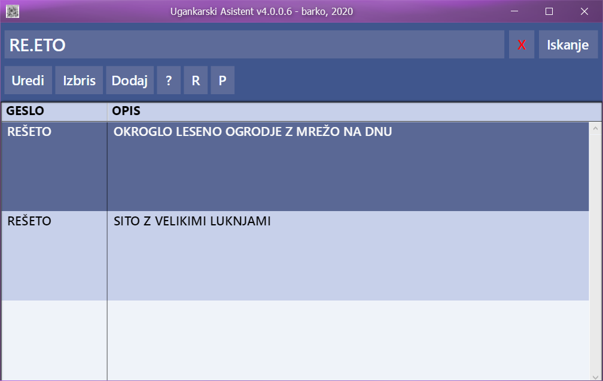

# Ugankarski Asistent - izdelano v <a href="https://livecode.org">LiveCode Community</a>
<a href="https://ugankarskiasistent.ga">

</a>

Podatkovna baza za Ugankarski Asistent (https://ugankarskiasistent.ga) v SQLITE v3 formatu in izvorna koda v LiveCode (https://livecode.org) programskem jeziku.

<a href="LICENSE">LICENCA</a>

Izvorno kodo (datoteka <a href="ua4-os.livecode">ua4-os.livecode</a>) odprete z LiveCode Community, kliknete na "Browse tool", aplikacija je pripravljena za delo. V kolikor dodate tudi <a href="database.db">database.db</a> datoteko ob izvorni kodi, boste lahko tudi iskali po bazi vseh gesel in opisov.

Za učenje programiranja v LiveCode je priporočljivo, da si ogledate vse spletne strani na https://livecode.com ali nabavite kakšno knjigo, priporočam knjigo <a href="http://www3.economy-x-talk.com/file.php?node=programming-livecode-for-the-real-beginner&fbclid=IwAR3ECEBve8CO_SVNwr7mN-GpGPo567owqUIpFv83qhiiyBacu7ENsEN9Qow">Programming LiveCode for the Real Beginner</a>, avtor Mark Schonewille.

Kako deluje:

1) aplikacija omogoča iskanje, dodajanje novih, urejanje obstoječih in brisanje gesel in opisov
2) iskanje poteka tako, da vpišemo v iskalno vrstico zaporedje znakov za gesla (primer: "REŠETO"), lahko uporabimo znak za piko "." za vse neznane črke v geslu, v kolikor želimo zožiti zadetke pa lahko dodamo ob geslu tudi delni opis gesla, ločen s presledkom (primer: "REŠETO SITO")
3) iskanje lahko izvedemo tudi samo po opisu, zato vpišemo v iskalno vrstico delni opis, uporabimo tudi presledek (primer: " SITO"), ki ločuje geslo od opisa
4) kako deluje zbiranje gesel in opisov uporabnikov? Aplikacija deluje v navezi s poštnim strežnikom, preko katerega uporabniki pošiljajo svoja urejanja gesel in opisov. Na epoštni naslov prejmem sporočilo v formatu, ki ga lahko (z nekaj popravki) s pomočjo internega programa vnesem v MYSQL bazo na strežniku, ki služi kot podlaga za spletno iskanje na naslovu https://ugankarskiasistent.ga/iskanje.html, nato iste podatke shranim v datoteko na strežniku, ki jo ob sprožitvi posodobitve baze s strani uporabnika, program prebere in vnese neobstoječe zapise, popravke v lokalno bazo uporabnika, tako postanejo vsi popravki dostopni vsem uporabnikom programa.

Izvršne datoteke:

LiveCode Community omogoča prevajanje izvorne kode (z določenimi nastavitvami), za uporabnike, ki niso vešči prevajanja izvršne kode so že pripravljene izvršne datoteke v naslednjih arhivih:

Windows verzja: <a href="https://ugankarskiasistent.ga/prenos/ua64-windows.zip">prenos 64</a> bit ali <a href="https://ugankarskiasistent.ga/prenos/ua32-windows.zip">prenos</a> 32 bit

Linux verzija: <a href="https://ugankarskiasistent.ga/prenos/ua64-linux.zip">prenos</a> 64 bit

Mac OS X verzija: <a href="https://ugankarskiasistent.ga/prenos/ua64-macosx.zip">prenos</a> 64 bit

Android od verzije 5 naprej: <a href="https://play.google.com/store/apps/details?id=com.preprosto.ua3">Google Play trgovina</a> (armv7, arm64, x86 in x86_64)

<a href="https://ugankarskiasistent.ga/#donacija">Donirajte</a> za razvoj v EUR, BTC ali ETH.

Obiščete lahko tudi <a href="https://ugankarskiasistent.ga/iskanje.html">on-line</a> različico.
